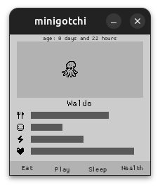

# Minigotchi
This is a very small desktop Tamagotchi built using the [**macroquad**](https://macroquad.rs/) crate. Your pet starts as an egg and
hatches quickly; you take care of it by interacting with on-screen buttons and watching simple
animations and movement behaviours.



## Description

Minigotchi is a compact virtual pet intended to run on the desktop. It demonstrates a small game loop,
simple animations, input-driven interactions, and persistent saves.

## Features

- Creature lifecycle
- Multiple different creatures to hatch 
- Feed, play and care actions
- Animated actions and simple movement behaviors
- Persistent save file written next to the executable (`save-file.txt`)

## Build

From the project root run:

```bash
cargo build --release
```

This produces an optimized binary in `target/release/minigotchi`.

## Run

- Run from source (debug):

```bash
cargo run
```

- Run the release build:

```bash
cargo run --release
# or
target/release/minigotchi
```

When the game saves it writes `save-file.txt` next to the running executable; see [src/save_management.rs](src/save_management.rs#L1-L40) for details.